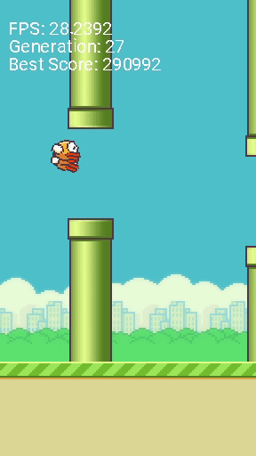

# NeuralNetwork FlappyBird
I was studing neural networks so i implemented a class in c++ and test it with a simple game made using SDL2.

  

I know the project need some improvements, and maybe in the future i solve some issues but, for my study is good enought.

## Todo
  - Reimplement Player class
  - Division between Data and Game related render operations (Now each player has the own texture, thats wast of memory)
  - Use better and faster random generators
  - Select diferent random distribuitions to randomize the matrixes in the neural network

  If you found something else fell free to make a issue.

## Build
You need `SDL2`, `SDL2_Image` and `SDL2_ttf` instaled, then:

    make

## Run 
Simple run:

    make run